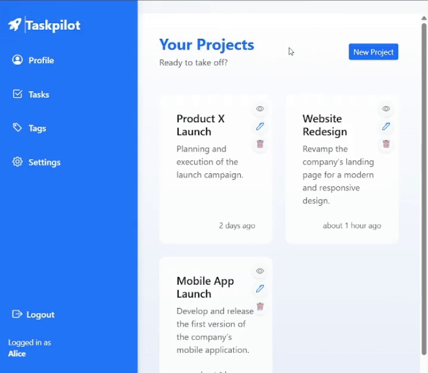
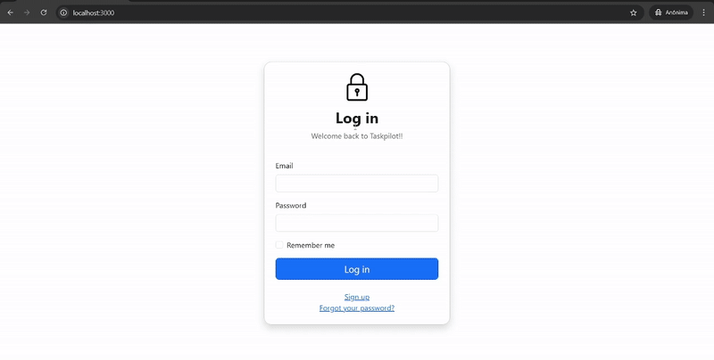
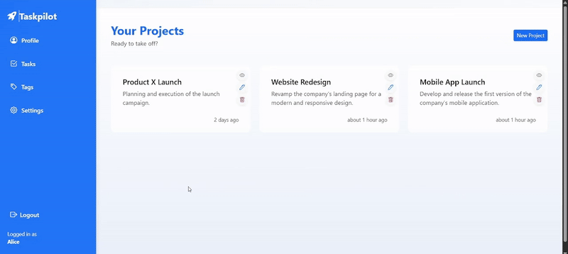
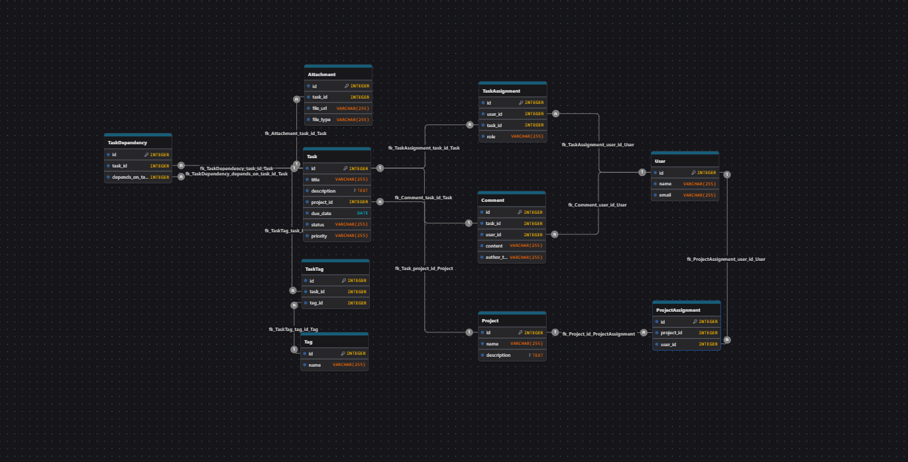

<p align="center">
  
</p>

<h1 align="center">Task Pilot GPT</h1>

<p align="center">
  <em>AI-powered project & task management, built with Ruby on Rails and OpenAI</em>
</p>

<p align="center">
  <a href="#">
    
  </a>
  <a href="#">
    
  </a>
  <a href="#">
    
  </a>
</p>

---

## Overview

***Task Pilot GPT*** is a Ruby on Rails application I developed for managing projects and tasks with AI-assisted planning. It aims to boost productivity by providing a user-friendly interface to organize your projects, leveraging the OpenAI API to break them down into smaller tasks and automatically prioritize them.

---

## Demo

<p align="center">
  
</p>

<p align="center">
  <i>Creating a new project, adding tasks and deleting the created project.</i>
</p>

---

<p align="center">
  
</p>

<p align="center">
  <i>User registration and login flow.</i>
</p>

---

<p align="center">
  
</p>

<p align="center">
  <i>Main menu after login: viewing tasks, tags, profile, settings and logout options.</i>
</p>

---

## Features

- **AI-powered task decomposition** (planned via ChatGPT API)
- **User-managed projects and tasks**
- **Multi-user collaboration** using `ProjectAssignment` (many-to-many)
- **Modular structure** for easy extension
- **Dynamic Bootstrap UI with modals**
- **Authentication with Devise**
- **BDD with RSpec + Capybara**

---

## Using the OpenAI API to Generate Initial Project Tasks

When a new project is created in **TaskPilot**, the system can automatically request initial task suggestions from the [OpenAI Chat Completions API](https://platform.openai.com/docs/api-reference/chat).

### Request Example
```ruby
client = OpenAI::Client.new(access_token: ENV["OPENAI_API_KEY"])

response = client.chat(
  parameters: {
    model: "gpt-4o-mini", 
    messages: [
      {
        role: "system",
        content: "You are a project planner that generates clear, realistic and actionable tasks for new projects."
      },
      {
        role: "user",
        content: "Generate 5 initial tasks for the project: 'Launch a personal portfolio website', including description and suggested due date."
      }
    ],
    temperature: 0.7
  }
)

puts response.dig("choices", 0, "message", "content")

```

---

## Tech Stack

- **Ruby on Rails 7**
- **PostgreSQL**
- **Devise for authentication**
- **OpenAI API** (for future AI integration)
- **Bootstrap 5**
- **Docker for deployment**

---

## Development Principles

- Behavior-Driven Development (BDD)
- Modular associations using `has_many :through`
- Clean UI patterns with reusable components
- Prepared for production using Docker

---

## Database Schema

<p align="center">
  
</p>

<p align="center">
  <i>Entity-relationship diagram showing users, projects, tasks, dependencies, tags, comments and assignments.</i>
</p>

---

## Running with Docker

```bash
docker build -t taskpilot_gpt .
docker run -d -p 80:80 \
  -e RAILS_MASTER_KEY=<your-master-key> \
  --name taskpilot_gpt taskpilot_gpt
