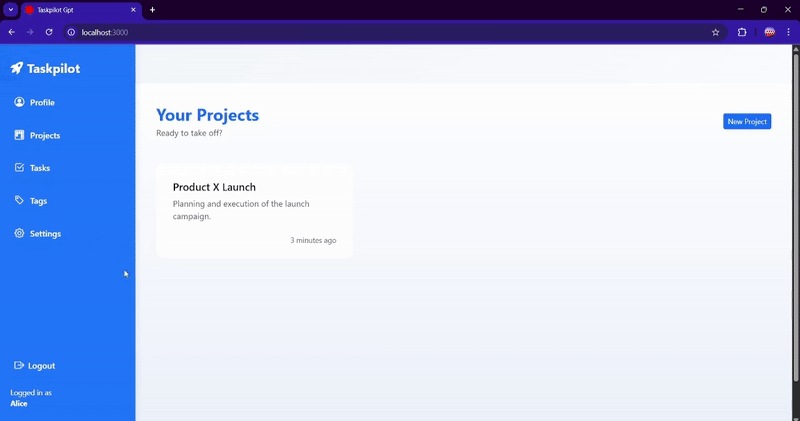

<p align="center" style="font-size: 4rem;">⚙<p>
<h1 align="center">GPT Task Assistant</h1>

<p align="center">
  <b>Intelligent task and project management with ChatGPT</b>
</p>

<p align="center">
  <a href="#"></a>
</p>

---

## Overview

**GPT Task Assistant** is a Ruby on Rails application for managing projects and tasks with AI-assisted planning. Built for teams and individuals looking to boost productivity through structured task breakdown, prioritization, and real-time collaboration.

---

## Demo

<p align="center">
  
</p>

## Features

- **AI-powered task decomposition** (planned via ChatGPT API)
- **User-managed projects and tasks**
- **Multi-user collaboration** using `ProjectAssignment` (many-to-many)
- **Modular structure** for easy extension
- **Dynamic Bootstrap UI with modals**
- **Authentication with Devise**
- **BDD with RSpec + Capybara**

---

## Tech Stack

- **Ruby on Rails 7**
- **PostgreSQL**
- **Devise for authentication**
- **OpenAI API** (for future AI integration)
- **Bootstrap 5**
- **Docker for deployment**

---

## Development Principles

- Behavior-Driven Development (BDD)
- Modular associations using `has_many :through`
- Clean UI patterns with reusable components
- Prepared for production using Docker

---

## Database Schema

<p align="center">
  
</p>

<p align="center">
  <i>Entity-relationship diagram showing users, projects, tasks, dependencies, tags, comments and assignments.</i>
</p>

---

## Running with Docker

```bash
docker build -t taskpilot_gpt .
docker run -d -p 80:80 \
  -e RAILS_MASTER_KEY=<your-master-key> \
  --name taskpilot_gpt taskpilot_gpt
